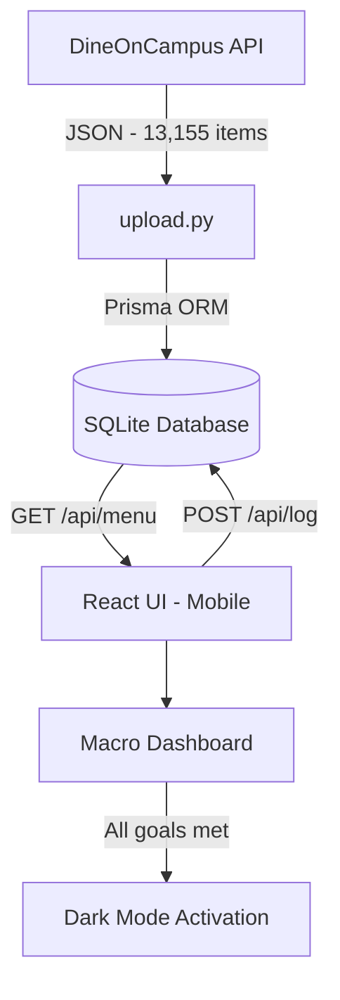

# DuckFitnessPal 🦆

Precision macro tracking for Stevens Institute of Technology students — powered by real campus dining data.

## Table of Contents

- [Motivation](#motivation)
- [Features](#features)
- [Demo](#demo)
- [Architecture](#architecture)
- [Data Flow](#data-flow)
- [Tech Stack](#tech-stack)
- [Installation](#installation)
- [Menu Data Pipeline](#menu-data-pipeline)
- [Contributing](#contributing)
- [Future Enhancements](#future-enhancements)
- [Acknowledgements](#acknowledgements)
- [License](#license)

## Motivation

Tracking macros as a college student shouldn't require a notebook and a calculator. But that's exactly what it takes when your only option is to manually look up every dining hall item, estimate portions, and multiply out the math yourself.

The data already exists. Stevens publishes the full Pierce Dining Hall menu daily through DineOnCampus — every item, every macro, every serving size. The problem isn't access to information. It's that no tool connects that data to the place where students actually make decisions: standing in line, choosing what to eat.

DuckFitnessPal eliminates tracking fatigue by ingesting the campus menu directly from the DineOnCampus API, loading it into a local database, and letting students log meals in one tap. The macros calculate themselves.

No searching, no estimating, no mental math.

## Features

- **Campus Menu Sync** — Live ingestion of 13,155+ menu items from the DineOnCampus API, covering full nutrition breakdowns for every item at Pierce Dining Hall
- **Smart Meal Periods** — Auto-categorizes and expands the current meal period based on Pierce's actual operating hours (weekday: Breakfast / Lunch / Dinner, weekend: Brunch / Dinner)
- **Macro Dashboard** — Real-time progress rings and bars for calories, protein, carbs, and fat against personalized daily targets
- **TDEE Calculator** — Profile-based goal engine using the Mifflin-St Jeor equation with cut, bulk, and maintain modes at configurable rates
- **Goal Tracking Toasts** — Amber notification when within 10% of a macro target, green celebration toast when a goal is hit
- **Achievement Dark Mode** — Full-app dark mode automatically activates when all macro goals are met for the day
- **One-Tap Logging** — Browse today's menu and log meals instantly with adjustable serving size multipliers
- **Personal Food Log** — View, manage, and delete logged meals with running daily totals

## Demo

<table style="width: 100%; border-collapse: collapse; border: none;">
  <tr style="border: none;">
    <td style="width: 50%; border: none; padding: 10px; text-align: center; vertical-align: top;">
      <strong>Profile & TDEE Setup</strong>
      <br><br>
      
    </td>
    <td style="width: 50%; border: none; padding: 10px; text-align: center; vertical-align: top;">
      <strong>Menu & Meal Logging</strong>
      <br><br>
      
    </td>
  </tr>
</table>


### Sample API Response

`GET /api/menu` — returns today's menu with per-item nutrition data:

```json
{
  "items": [
    {
      "name": "Grilled Chicken Breast",
      "station": "Grill",
      "calories": 284,
      "protein": 53,
      "carbs": 0,
      "fat": 6,
      "servingSize": "6 oz"
    },
    {
      "name": "Brown Rice",
      "station": "Sides",
      "calories": 216,
      "protein": 5,
      "carbs": 45,
      "fat": 2,
      "servingSize": "1 cup"
    }
  ]
}
```

## Architecture

```
DuckFitnessPal/
├── app/
│   ├── api/                # REST endpoints — menu, food log, profile, goals
│   ├── menu/               # Smart meal period display
│   ├── log/                # Personal food log
│   ├── profile/            # TDEE calculator and goal setup
│   └── layout.tsx          # Root layout with DarkModeProvider
├── components/
│   ├── MacroDashboard.tsx  # Calorie ring + macro progress bars
│   ├── MenuSection.tsx     # Collapsible meal period sections
│   ├── FoodLogItem.tsx     # Log entry with serving multiplier and delete
│   ├── NavBar.tsx          # Bottom navigation
│   └── DarkModeProvider.tsx # Achievement-triggered dark mode context
├── lib/                    # Prisma client, shared types, utilities
├── prisma/                 # Schema and migrations
├── scraper/
│   └── upload.py           # DineOnCampus JSON parser → SQLite sync
└── public/                 # Static assets
```

## Data Flow



1. Menu data is sourced from the DineOnCampus API — the same endpoint that powers Stevens' dining portal
2. `upload.py` parses the raw JSON and syncs all items into SQLite via Prisma
3. The frontend fetches today's menu and auto-opens the active meal period based on Pierce's hours
4. Users log meals with one tap — each entry is stored with a timestamp and serving multiplier
5. The dashboard recalculates running macro totals against TDEE-based goals in real time
6. Toast notifications fire at 90% of each target; dark mode activates when all goals are hit

## Tech Stack

| Layer | Technology |
|-------|-----------|
| Frontend | Next.js 16, React 19, TypeScript |
| Styling | Tailwind CSS 4, class-based dark mode |
| Database | SQLite via Prisma ORM |
| Data Pipeline | Python 3, DineOnCampus API |
| Goal Engine | Mifflin-St Jeor TDEE formula |

## Installation

```bash
# Clone the repo
git clone https://github.com/KritinRane/DuckFitnessPal.git
cd DuckFitnessPal

# Install dependencies
npm install

# Initialize the database
npx prisma db push

# Start the dev server
npm run dev
```

App runs at `http://localhost:3000`.

### Environment Variables

Create a `.env` file in the project root:

```
DATABASE_URL="file:./dev.db"
```

No external API keys required for local development.

## Menu Data Pipeline

Menu data is pulled from Stevens' DineOnCampus API — the same endpoint that powers the university's dining portal. The JSON is extracted via a browser console script, then parsed and uploaded to the local database.

```bash
cd scraper
pip install -r requirements.txt
python upload.py
```

The current dataset covers 13,155 menu items across April–May 2026, with full nutrition breakdowns and serving sizes for every item at Pierce Dining Hall.

## Contributing

1. Fork the repo
2. Create a feature branch (`git checkout -b feature/your-feature`)
3. Commit with descriptive messages
4. Ensure tests pass and add coverage for new functionality
5. Open a Pull Request

### Code Style

- TypeScript strict mode — no `any` types
- Prisma for all database operations — no raw SQL
- Components are small, focused, and self-contained
- Descriptive variable and function names throughout

## Future Enhancements

- **Automated daily scraper** — Cron job to pull the next day's menu automatically
- **Stevens email auth** — `.edu` email verification for user accounts
- **Macro history** — Weekly and monthly trend visualization
- **Meal plan optimizer** — Recommend dining hall combinations that hit macro targets
- **Multi-dining-hall support** — Extend beyond Pierce to all Stevens dining locations
- **PWA support** — Installable on mobile home screens for native app feel
- **Barcode scanner** — Log off-campus meals via UPC lookup
- **Social features** — Share daily logs and compete with friends on macro consistency

## Acknowledgements

- [DineOnCampus](https://www.dineoncampus.com/) — Campus dining API
- [Prisma](https://www.prisma.io/) — Type-safe database ORM
- [Next.js](https://nextjs.org/) — Full-stack React framework
- [Tailwind CSS](https://tailwindcss.com/) — Utility-first styling
- Mifflin-St Jeor equation for TDEE calculations

## License

MIT

---

Built by **Kritin Rane** — Computer Science, Stevens Institute of Technology
